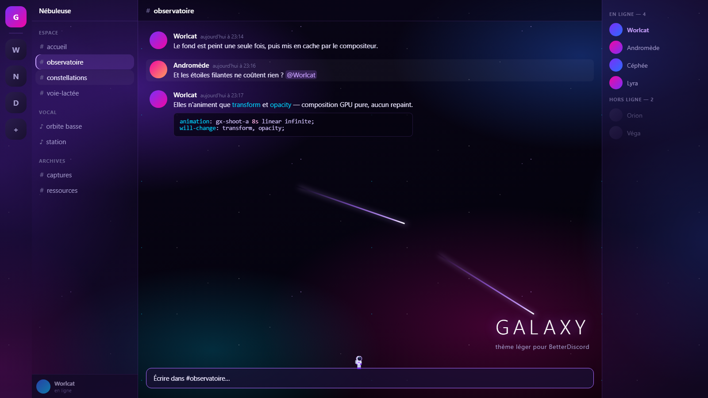

# Galaxy

Thème spatial pour [BetterDiscord](https://betterdiscord.app), conçu pour être **léger** :
le fond est peint une seule fois, il n'y a aucun `backdrop-filter`, et les seules
animations n'utilisent que `transform` et `opacity` — donc composition GPU pure,
sans repaint ni recalcul de layout.

## Aperçu

- Fond d'espace profond : nébuleuses violet / magenta / bleu / cyan et champ d'étoiles.
- Accents violets : salon actif, pilule de sélection, mentions, scrollbars, boutons.
- Un astronaute traverse la barre de saisie à pied — sprite SVG intégré, aucune image à charger.

## Installation

1. Télécharger `Galaxy.theme.css`.
2. Le placer dans le dossier des thèmes BetterDiscord :
   - Windows : `%APPDATA%\BetterDiscord\themes`
   - macOS : `~/Library/Application Support/BetterDiscord/themes`
   - Linux : `~/.config/BetterDiscord/themes`
3. Activer **Galaxy** dans *Paramètres → Thèmes*.

## Personnalisation

Tout se règle dans le bloc `1. PALETTE` en haut du fichier.

| Variable | Rôle |
| --- | --- |
| `--gx-nebula-1` … `-4` | Les quatre couleurs des nébuleuses |
| `--gx-accent` | Couleur d'interaction (salon actif, mentions, scrollbars) |
| `--gx-void`, `--gx-deep` | Fond de l'espace |
| `--gx-panel`, `--gx-panel-2` | Opacité des panneaux |
| `--gx-radius` | Arrondi des surfaces |

Vitesse de l'astronaute : la durée `38s` de l'animation `gx-walk` en section 8,
et `0.56s` pour la cadence des pas — garde un rapport cohérent entre les deux,
sinon il glisse au lieu de marcher.

Pour un thème totalement statique, commente les lignes `animation:` de la
section 8. Le thème respecte également le réglage système « réduire les
animations ».

## Notes de performance

Ce qui est volontairement absent, et pourquoi :

- **`backdrop-filter`** — recompose tout ce qui se trouve derrière la surface à
  chaque frame. C'est de loin le poste le plus coûteux dans un thème Discord.
- **`filter` animé** (`hue-rotate`, `drop-shadow`) sur des couches plein écran —
  repaint permanent, même fenêtre inactive.
- **Les animations de fond continues** — mesurées à ~40 % d'un cœur pour une
  seule couche plein écran, et 5 % pour deux étoiles filantes pourtant
  invisibles 85 % du temps. Une animation qui tourne empêche le compositeur de
  s'endormir, indépendamment de ce qu'elle dessine.
- **Sélecteurs fourre-tout** (`[class*="container_"]`, `[class*="scroller_"]`) —
  ils matchent des milliers de nœuds à chaque recalcul de style.

## Licence

MIT — voir [LICENSE](LICENSE).
